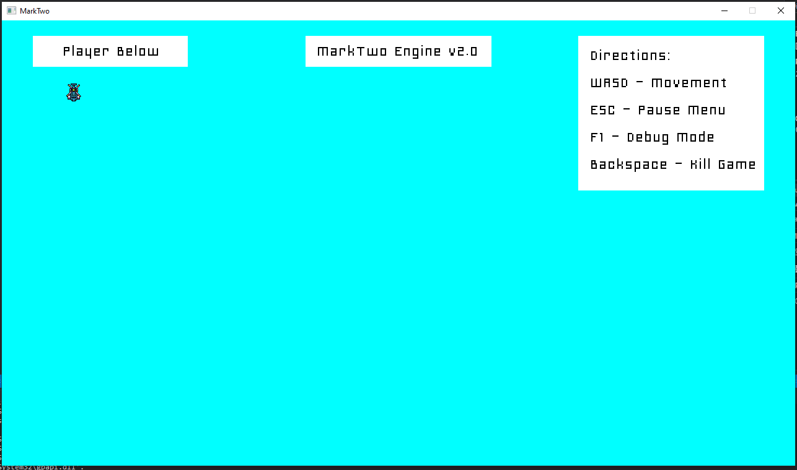

# MarkTwo Engine v2.0

### Overview


The MarkTwo engine is the second iteration of an ongoing 2D game engine project. Just like Tony Stark making his Iron Man suit in a cave with a “Box of scraps,” the MarkTwo engine project uses all open source libraries and dependencies to create 2D games. The engine was made for educational purposes under the MIT license.

[Here](https://www.lukaspowers.com/post/marktwo-engine-v2-0) is an article about the v2.0 release of MarkTwo.


### How To Build and Run
The project has been updated to use CMake as its build and packaging tool. If you have not used CMake before, feel free to check it out using the link [HERE](https://cmake.org/).

1. Install CMake on your PC using the link above.
2. Download this project from GitHub.
3. Open the project in the file explorer and open a Command Prompt from that location.
4. With the Command Prompt open, type in the commands:
```
> mkdir Debug
> cd Debug
> cmake ..
> cmake --build .
```
5. After the CMake is complete, go back to the file explorer and open the newly created `Debug` folder.
6. Double click the Visual Studio solution file CMake just created.
7. In Visual Studio's solution explorer, set the `MarkTwo` solution as the target solution.
8. Rebuild and run.


### How To Package a Build
The project uses CPack and Nullsoft Install System for its packaging system. Click [HERE](https://cmake.org/cmake/help/book/mastering-cmake/chapter/Packaging%20With%20CPack.html) for more information on CPack.

1. Install CMake on your PC using the link above.
2. Download this project from GitHub.
3. Open the project in the file explorer and open a Command Prompt from that location.
4. With the Command Prompt open, type in the commands:
```
> mkdir Release
> cd Release
> cmake -DCMAKE_BUILD_TYPE=Release ..
> cmake --build . --config Release
> cpack --config CPackConfig.cmake
```
5. After CPack is complete, it will create a `.exe` file in the Release directory. Double click the `.exe` file and follow the prompts.


### Development
This engine was written in C++. It uses std, SDL2, and Rapidxml libraries. It is uses Cmake as its build and packaging tool. Feel free to reach out if you have any questions or comments!